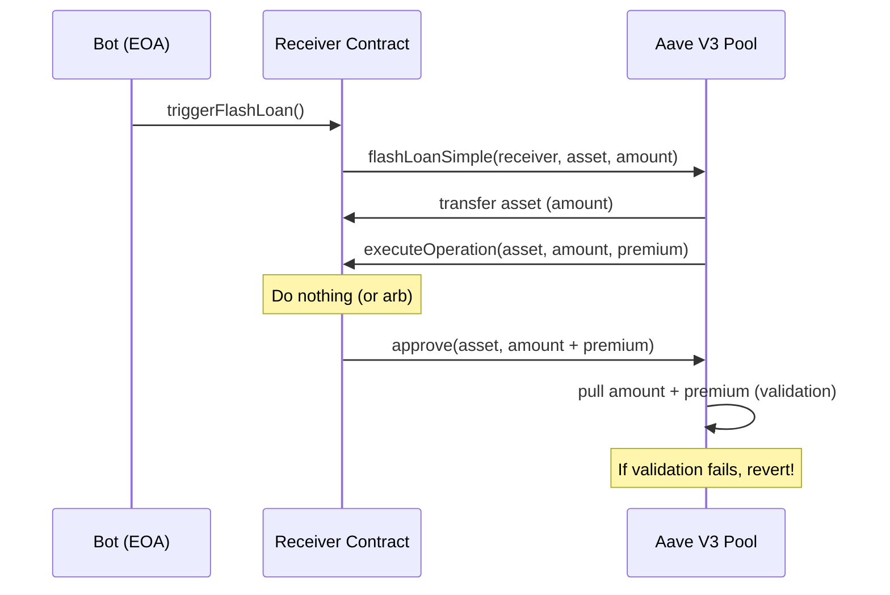

# Knowledge Base

## A. EVM Fundamentals
- **Storage vs Memory vs Calldata Gas Costs**: 
  - **Storage**: Most expensive. Reading (SLOAD) costs 2100 gas for cold access, 100 for warm. Writing (SSTORE) costs 20,000 gas (from zero to non-zero) or 2,900 gas (modifying existing).
  - **Memory**: Cheaper, linear cost plus quadratic expansion cost. Expanding memory costs roughly `(memory_size_in_words^2) / 512`.
  - **Calldata**: Read-only, cheap. Costs 16 gas per non-zero byte, and 4 gas per zero byte (as of EIP-2028).
- **msg.sender vs tx.origin**:
  - `msg.sender`: The address that called the current contract (can be another contract or an EOA).
  - `tx.origin`: The original EOA (Externally Owned Account) that started the transaction chain.

## B. Flash Loan Mechanics
- **The Atomic Callback Pattern**:

- **Why the entire tx reverts if repayment fails**: EVM transactions are atomic. The Aave Pool asserts at the end of the `flashLoanSimple` function that it has received the `amount + premium`. If not, it executes a `revert()`, which undoes all state changes in the entire transaction.
- **Fee Structures**: Aave V3 generally charges a 0.05% (5 bps) fee on flash loans, while Balancer V2 offers flash loans with 0% fees (though subject to change via governance).

## C. Health Factor Formula
**Formula**: `HF = Σ(collateral_i × price_i × liquidationThreshold_i) / Σ(debt_j × price_j)`

**Worked Example**:
- Collateral: 1 ETH, Price: $3000, Liquidation Threshold: 80% (0.80)
- Debt: 2000 USDC, Price: $1.00
- HF = (1 * 3000 * 0.80) / (2000 * 1) = 2400 / 2000 = 1.2
- A Health Factor < 1.0 means the position can be liquidated.

**Return values of getUserAccountData()**:
- `totalCollateralBase`: Total value of all collateral in base currency (USD with 8 decimals).
- `totalDebtBase`: Total value of all borrowed assets in base currency (USD with 8 decimals).
- `availableBorrowsBase`: Borrowing power left in base currency.
- `currentLiquidationThreshold`: Weighted average liquidation threshold of the collateral (4 decimals, e.g., 8000 = 80%).
- `ltv`: Weighted average Loan-To-Value (4 decimals). Maximum borrow limit before liquidation threshold.
- `healthFactor`: Current health factor (18 decimals). Below 1e18 means liquidatable.

## D. Base L2 Architecture
- **OP Stack Transaction Lifecycle**: Transactions are sent to the sequencer, batched, and posted as calldata/blobs to Ethereum L1. Fault proofs guarantee execution correctness.
- **FIFO Sequencer Ordering**: Base operates a sequencer without a public mempool (currently). Transactions are processed First-In-First-Out based on arrival time. There is no gas-price bidding (PGA) to frontrun; speed of submission (network latency) to the sequencer is what matters for MEV.
- **L1 Data Availability Costs**: L2 transaction fees are heavily influenced by the cost to post data to L1. With EIP-4844 (blobs), this cost is drastically reduced, making operations like liquidations much cheaper.

## E. AMM/DEX Mechanics
- **Uniswap V3 Concentrated Liquidity**: Liquidity providers provide capital within specific price ticks (ranges). This increases capital efficiency but can cause high price impact (slippage) if a trade pushes the price out of heavily concentrated ticks.
- **Slippage Tolerance**: The maximum acceptable difference between the expected price of a trade and the actual executed price. If execution falls outside this bound, the trade reverts.
